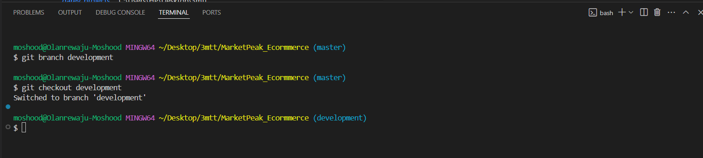

# E-Commerce Platform Deployment with Git, Linux, and AWS

## Scenario

You have been assigned to develop an e-commerce website for a new online marketplace named "MarketPeak". Thisplatform will feature product listings, a shopping cart, and user authentication.

## Obejective

- Utilize Git for version control
- Develop the platform in a linux environment
- Deploy on an AWS EC2 instance.

## Tasks

1. Implement Version Control with Git

- Created a project directory named "MarketPeak_Ecormmerce"

- Initialized git repository to manage version control.

- Obtained and prepared the e-commerce website template from [tooplate](https://www.tooplate.com/view/2130-waso-strategy).

- Staged and commit the template to git.

- Linked and pushed the project to the remote repository on Github.

2. AWS Deployment

- Set up aws ec2 instace on the management console and connected to the instance using SSH
- Cloned the project repo on Github using the SSH link.

- Generated ssh key from the ec2 instance using the command `ssh-keygen` and added it to my Github account for communication with the instance.

- Installed http server(httpd) to serve the html files and content over the internet. This was done with the codes below:
`sudo yum update -y`
`sudo yum install httpd -y`
`sudo systemctl start httpd`
`sudo systemctl enable httpd`

- The httpd server was configured by removing the default html files and replacing them with the website files.
This was done with the codes below:
`sudo rm -rf /var/www/html/*`
`sudo cp -r marketpeak_ecormmerce/2130_waso_strategy/* /var/www/html/`

- Reloaded the server and accessed the website from the browser using the ec2 instance public ip address.

- Simulated continuos integration and deployment workflow with the steps below:
- Created a new branch(development) and did some update on the website code.

- Staged, commit and push the changes made to the code to the development branch.

- Created pull request and merged the changes with the master branch.

- Tested the new changes made to the website
Changed the site title from "Waso" to "Moshood".

